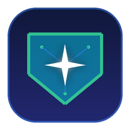

# 🛡️ Clash Gemini Guardian (Clash 智能节点守护控制台)

<p align="center">
  
</p>

<p align="center">
  <strong>专为 Google Gemini / Antigravity / Claude 等 AI 工具打造的智能节点体检与自动优选控制台</strong>
</p>

<p align="center">
  <a href="LICENSE"></a>
  <a href="https://www.python.org/"></a>
  </a>
  </a>
</p>

---

## 🌟 解决的核心痛点

在日常使用 **Google Antigravity** 或 **Gemini API** 编程时，经常会遇到 `Agent execution terminated due to error` 的报错终止，根本原因在于：

1. **常规测速盲区**：标准 Clash 测速仅检测 `generate_204` 或 Cloudflare，很多节点（如香港节点）物理延迟低，但访问 Gemini API 时会被 Google 官方判定为 `User location is not supported`（400 地区封锁）。
2. **长连接/流式断流**：AI 编程采用高频 SSE (Server-Sent Events) 与 HTTP/2 流式长连接，劣质或高负载节点在通信中途断流，导致智能体意外崩溃。
3. **节点假死与超时**：部分节点虽然在线，但向 Google 官方核心服务器请求时直接抛出 `503 Service Unavailable` 或 `504 Gateway Timeout`。

**Clash Gemini Guardian** 直接通过内核向 **Google Gemini 官方服务器 (`generativelanguage.googleapis.com`) 发起真实的 TCP/TLS 握手与连通性深度体检**，智能过滤受限与异常节点，毫秒级自动切换策略组至最优可用节点。

---

## ✨ 主要特性

- 🚀 **真实端到端 Gemini 探测**：全量并发向 Google Gemini 官方 API 实地握手测速，毫秒级获取真实可用性与延迟。
- 🟡 **地区受限智能标记**：精准识别并降权香港（HK）等 Google 官方政策限制区域，杜绝 400 报错。
- 🖥️ **现代化可视化桌面客户端**：
  - 自适应系统深浅主题（Dark Glassmorphism / Clean Light）。
  - 全量节点健康状态卡片（🟢 完美支持 / 🟡 地区受限 / 🔴 异常超时）。
  - 支持“一键体检与最优切换”与“任意节点手动一键切换”。
  - 地区标签快速过滤（🇹🇼 台湾、🇯🇵 日本、🇸🇬 新加坡、🇲🇾 马来西亚、🇰🇷 韩国、🇺🇸 美国、🇪🇺 欧洲等）。
- 🛡️ **后台自动守护与故障转移**：开启后持续心跳监控当前节点，当网络恶化或断流时毫秒级无感切换至备用好节点。
- 🪟 **系统级深度集成**：
  - 单实例互斥保护（防多开重叠）。
  - Windows 原生任务栏系统托盘常驻与右键快速菜单。
  - Windows 原生 Toast 桌面弹窗通知。
  - 一键生成专属 3D 图标桌面快捷方式。

---

## 🔌 客户端兼容性

本工具基于通用 **Clash REST API (External Controller)** 标准构建，全面支持：
* **Clash Mi**（自动免密识别）
* **Clash Verge Rev**
* **Mihomo Party**
* **FlClash**
* **Clash Nyanpasu**
* **Clash for Windows (CFW)**
* **sing-box**（开启 `experimental.clash_api` 兼容模式即可）

---

## 🚀 快速开始

### 方式一：直接双击运行（无需命令行）
* **免安装绿色单文件**：直接双击运行 **`Clash-Gemini-Guardian.exe`** 即可打开控制台并在系统托盘常驻守护。
* **桌面快捷方式**：双击运行 `创建桌面快捷方式.bat`，桌面上即可生成带有专属 3D 图标的快捷方式。

### 方式二：命令行极简模式
* **极速体检与优选**：双击 `一键测试并优选节点.bat` 或运行 `python gemini_clash_guardian.py`
* **后台命令行守护**：双击 `启动后台自动守护.bat` 或运行 `python gemini_clash_guardian.py --daemon`

---

## ⚙️ 配置文件 (`config.json`)

```json
{
  "clash_api_url": "http://127.0.0.1:9090",
  "clash_api_secret": "auto",
  "service_json_path": "auto",
  "gemini_test_urls": [
    "https://generativelanguage.googleapis.com",
    "https://alkalimakersuite-pa.googleapis.com"
  ],
  "timeout_seconds": 5,
  "max_workers": 12,
  "daemon_interval_seconds": 180,
  "notification_enabled": true,
  "target_group_keywords": [
    "节点选择",
    "PROXY",
    "GLOBAL",
    "Proxies",
    "Select"
  ]
}
```

---

## 📁 项目结构

```text
├── web/                           # 前端界面静态资源 (HTML5/CSS3/JS)
│   ├── favicon.ico                # 网页 Favicon
│   ├── icon.png                   # 高清应用 Logo
│   ├── index.html                 # 现代化控制台单页
│   ├── style.css                  # 自适应响应式样式表
│   └── app.js                     # 前端交互与 API 通信
├── app.ico                        # Windows 标准多尺寸图标 (16-256px)
├── app_icon.png                   # 512x512 高清 3D 原生图标
├── gui_app.py                     # GUI 桌面端微服务与系统托盘主程序
├── gemini_clash_guardian.py       # 核心测速与 Clash 策略切换引擎
├── create_shortcut.py             # 桌面快捷方式生成工具
├── generate_app_icon.py           # 3D 图标生成脚本
├── config.json                    # 默认配置文件
├── requirements.txt               # Python 依赖清单
├── LICENSE                        # MIT 开源协议
├── 启动桌面应用程序.bat             # 启动 GUI 桌面应用
├── 创建桌面快捷方式.bat             # 一键在桌面创建快捷方式
├── 一键测试并优选节点.bat           # 命令行测速脚本
└── 启动后台自动守护.bat             # 命令行后台守护脚本
```

---

## 📄 开源协议

本项目采用 [MIT License](LICENSE) 许可协议。
